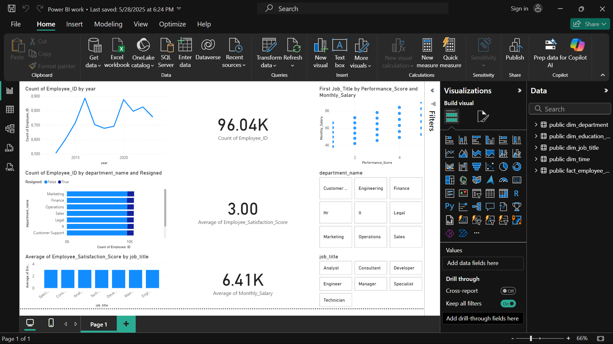
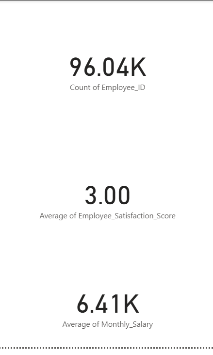
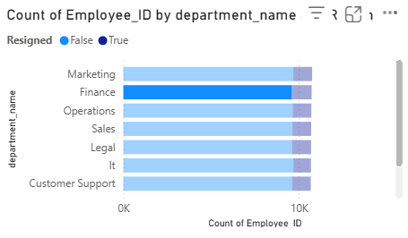
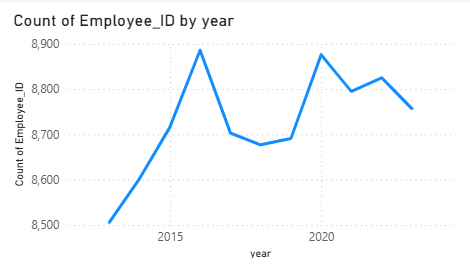
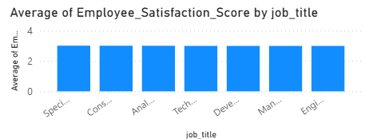
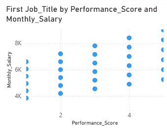
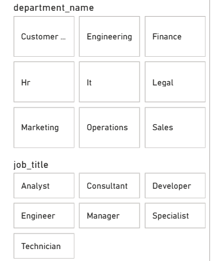

# Data Warehousing & Big Data — HR Analytics Star Schema (PostgreSQL + Power BI)

**Course:** COMP8812 — Data Warehousing & Big Data  
**Title:** Designing a Scalable HR Analytics Pipeline: From Semi-Structured Data to Interactive Visualisation  
**Stack:** Python (pandas/SQLAlchemy), PostgreSQL (pgAdmin 4), Power BI

## Project Overview
End-to-end warehousing project that converts a flat HR dataset into a **star schema** and an interactive **Power BI** dashboard.

**Dataset evolution**
- `Extended_Employee_Performance_and_Productivity_Data.csv` — original Kaggle dataset, ~100,000 rows, 20 columns  
- `Semi-Structured_...csv` — deliberately "messy" version (inconsistent headers, composite fields) to mimic real-world data cleaning  
- `Cleaned_Extended_...csv` — final structured dataset, ~96,035 rows, 20 columns (uniform naming, realistic `hire_date`, temporal columns)

## Star Schema (PostgreSQL)
**Fact table**
- `fact_employee_performance(employee_id, department_id, job_id, education_id, time_id, monthly_salary, performance_score, employee_satisfaction, resigned, remote_work_frequency, training_hours, promotions, sick_days)`

**Dimensions**
- `dim_department(department_id, department)`  
- `dim_job_title(job_id, job_title)`  
- `dim_education_level(education_id, education_level)`  
- `dim_time(time_id, hire_date, year, month, quarter)`

## Power BI Dashboard (Key visuals & interactions)
- **KPIs:** total employees, resigned employees, average satisfaction, average salary  
- **Charts:** resignations by department (stacked bar), hiring trend by year (line), avg satisfaction score by job title (column), salary vs performance (scatter)  
- **Slicers:** department, job title, resignation status, gender, year

### Power BI file (view only)
Link: <https://drive.google.com/file/d/1H9LwBng8vtCvXU2txJ15jqJbHcIYeX45/view?usp=sharing>

## How to Reproduce
1. **Environment**
   ```bash
   python -m venv .venv && source .venv/bin/activate   # Windows: .venv\Scripts\activate
   pip install -U pip wheel
   pip install pandas numpy SQLAlchemy psycopg2-binary matplotlib
   ```
2. **Database**
   - Create a PostgreSQL database (e.g., `employee_performance_dw`).
   - Run `sql/ddl.sql` to create dimensions + fact.
   - Use Python/SQLAlchemy or `COPY` to load the cleaned CSV into staging, then populate dims and update fact FKs (`sql/sample_queries.sql` includes examples).
3. **Power BI**
   - Connect to PostgreSQL (Model View → confirm relationships).
   - Re-create visuals (KPI cards, trends, stacked bars, scatter).
   - Add slicers for Department, Job Title, Gender, Resigned, Year.

## Repository Layout (this folder)
```
data-warehousing-bigdata/
├── notebooks/                # place COMP8812 DW notebooks here
├── sql/
│   ├── ddl.sql               # CREATE TABLE scripts (dims + fact)
│   └── sample_queries.sql    # inserts, FK updates, and KPI/visual queries
└── README.md
```

## Dashboard Preview


**KPIs & Visuals**







## Notes
- Raw `.csv` and `.pbix` files are **not** committed (see `.gitignore`). Use the view-only PBIX link above.
- If sharing data, include a **100–500 row sample** only, or a link to the public source.
- Licensed under MIT (see root LICENSE).
