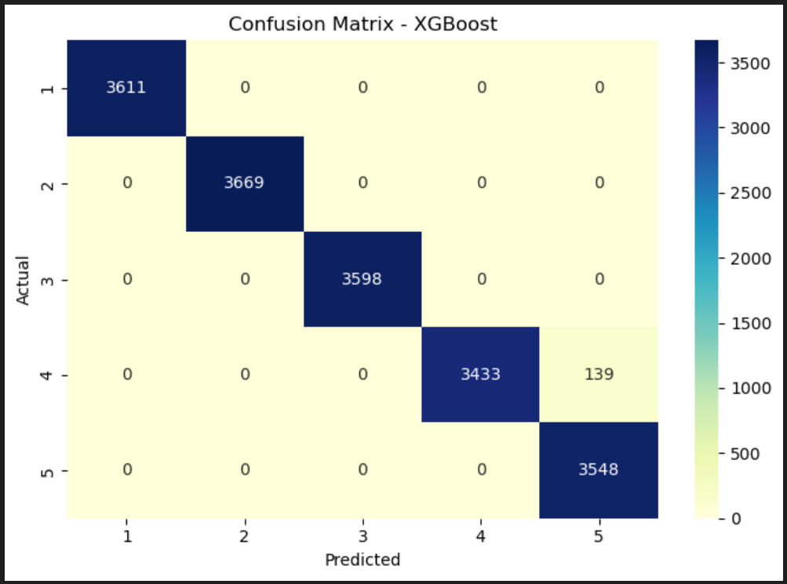
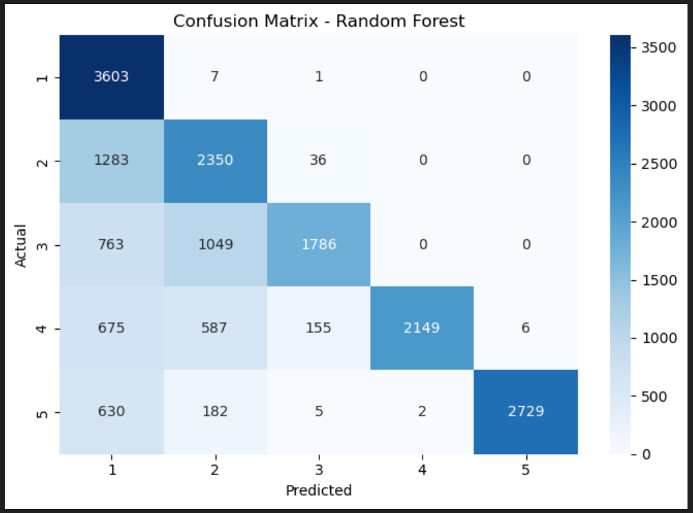
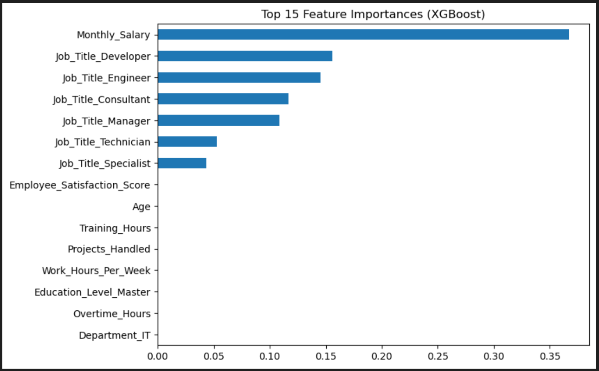
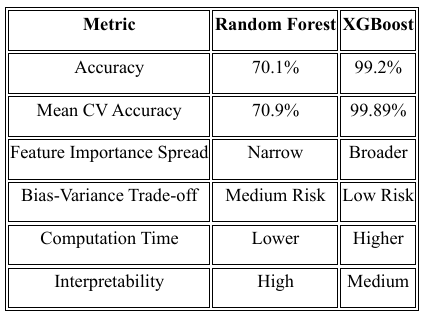

# Employee Performance Prediction — Random Forest & XGBoost

**Objective.** Predict employee **performance score (1–5)** from behavioural and job‑related attributes using supervised learning. Includes **bias‑aware preprocessing**, **model comparison**, **cross‑validation**, and **feature‑importance** analysis.

## Key Features
- Data cleaning & engineering (drop sensitive IDs, remove resigned employees, compute `Years_At_Company`).
- One‑hot encoding for categorical attributes; all‑numerical modeling table.
- Models: **Random Forest** and **XGBoost** with tuned hyperparameters.
- Evaluation: Accuracy, precision/recall/F1 by class, confusion matrices, bias‑variance curves, 5‑fold CV.
- Interpretation: Feature importance — **Satisfaction_Score**, **Projects**, **Work_Hours**, **Promotions**, **Training**, **Years_At_Company**.

## Repo Layout
```
notebooks/
  01_prepare_data.ipynb
  02_train_random_forest.ipynb
  03_train_xgboost.ipynb
  04_evaluate_visualise.ipynb
data/ (gitignored)
```

## How to Run
1. Create env & install basics:
   ```bash
   python -m venv .venv && source .venv/bin/activate  # Windows: .venv\Scripts\activate
   pip install -U pip wheel
   pip install numpy pandas scikit-learn xgboost matplotlib plotly
   ```
2. Place the dataset(s) under `data/` (not tracked). Use public links if allowed.
3. Open each notebook in order and run all cells.

## Results (to reproduce)
- Random Forest test accuracy: ~0.70
- XGBoost test accuracy: ~0.99
- Most influential predictors: satisfaction, projects, work hours, promotions, training, tenure.

## Model Results




